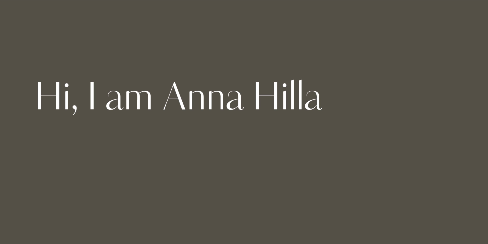

### About Me

Hi! I'm Anna, a Frontend Web Developer based in Barcelona. I thrive on learning and love diving into a wide range of interests — from cooking to web development. My goal is to build clean, user-friendly web applications and to collaborate with amazing teams on exciting projects. I studied nursing at university so I love creating apps that promote health and well-being.

### My latest projects

Here are the latest projects that I’ve worked on:

**Nissu**: Nissu is a fun and motivating habit streak tracker built with React Native and Expo. Complete daily habits, maintain your streaks, and help a little cat named Nissu build a tall cozy home for each habit – one floor at a time. I used TypeScript, Nativewind for styling, Context for state management and Appwrite for authentication and database.

<a href="https://github.com/annahilla/nissu">View Repository</a> / <a href="https://github.com/annahilla/nissu-landing">View Landing Page Repository</a> / <a href="https://nissu.app">View Landing Page Live</a>

**Planutri**: A full-stack Next.js applicacion to plan your weekly menu and generate a shopping list. It features a meal planner, shopping list, a form to create a public or private recipe and a recipes list with all the recipes. I used Typescript, TailwindCSS for styling, Context for state management, Firebase for authentication and MongoDB for the database.

<a href="https://github.com/annahilla/planutri">View Repository</a> / <a href="https://planutri.vercel.app/">View Live Version</a>

**WellPulse**: A comprehensive MERN stack application designed to track healthy habits. It features a calendar to manage habits, progress charts to visualize improvement, and an interactive map displaying locations where users can perform their habits. On the frontend, I used Typescript, Redux for efficient state management, React Router for seamless navigation, Firebase for secure authentication, and Tailwind CSS for responsive, modern styling. The backend is built with Node.js and Express, ensuring smooth and scalable functionality.

<a href="https://github.com/annahilla/wellpulse">View Frontend Repository</a> / <a href="https://github.com/annahilla/wellpulse-api">View Backend Repository</a> / <a href="https://wellpulse.vercel.app/">View Live Version</a>

    

### Technologies & Tools

I enjoy working with modern tools and frameworks to create responsive and engaging web experiences:

  
  
  
  
  
  
  
  
  
  
  
  
  
  
  
  
  
  
  
  
  
  
  
  
  

### What I'm currently learning

- **React Native & Expo**: Deepening my knowledge of mobile development to build performant cross-platform apps. Currently working on animations, navigation stacks, and integrating backend services like Appwrite.
- **Vue.js**: Exploring the Vue ecosystem to broaden my frontend horizons and understand different approaches to component-based development.

### Want to collaborate?

I’m always open to collaborating on exciting projects or contributing to open-source initiatives. You can contact me via mail clicking down here.

  

